

<h1 align="center" style="margin: 30px 0 30px; font-weight: bold;">Dahuang-Wvp</h1>
<h4 align="center">基于ruoyi和wvp的国标视频管理平台，开箱即用、完全开源、使用MIT许可协议</h4>

## 平台介绍

dahuang-wvp是基于ruoyi-vue和wvp框架的全部开源的GB/T 28181-2016，兼容2022视频平台，保留版权的情况下可以用于商业项目。重点对前端UI进行升级优化
* 最新更新已GITEE为准
* 演示地址
  https://wvp.zgdahuan.com/
   账号：admin
   密码：admin1234

* 平台使用手册
  https://my.feishu.cn/wiki/VAAgwKRMkiMJ2dkBIWDcu7HKneb?from=from_copylink
## 最近更新

v2.0.1 （2026-08-08）
* 修复国标设备编辑时，订阅配置变更时自动触发SIP订阅同步
* 新增地图配置与Logo配置的增删改查接口及缓存刷新机制
* 移动位置消费改为"先读后删"模式，确保DB写入失败不丢数据
* 统一使用MD5算法进行GB28181设备注册认证
* 移除大屏统计接口的匿名访问注解
* 其他已知小BUG

v2.0.0 （2026-08-05）
* 1.全面兼容GB28181-2022
* 2.登录，修改，密码相关接口全部进行加密
* 3.增加初始密码修改,过期密码修改
* 4.流媒体添加ng代理相关配置
* 5.修复设备列表以及通道列表分页不生效BUG
* 6.其他已知小BUG

（2026-07-31）
* 支持Postgres数据库
* 优化设备查询过滤通道权限

（2026-07-19）
* 支持达梦数据库
* 支撑内置sqlite数据库，做到无数据库使用
* 国标设备推拉流 统一一张表
* 增加AK/SK 认证，给业务系统调用接口
* 代码虽然很乱，但是后续会慢慢重构，欢迎star、fork、订阅，一起加油

## 概述

* dahuang-wvp 是基于GB/T 28181-2016标准全部开源的国标视频平台 兼容2022,依托优秀的开源流媒体服务[ZLMediaKit](https://github.com/ZLMediaKit/ZLMediaKit) ,实现了高效、稳定的流媒体处理功能。
* 整合了优秀的开源框架 ruoyi-vue，极大地提升了开发效率。
* 支持通过国标 28181 协议将各类摄像头和录像机轻松接入平台，实现视频流的在线观看与分发。
* 支持加载动态权限菜单，多方式轻松权限控制,支持多终端认证系统。
* 重点对前端UI进行升级优化，请查看效果图

## 技术栈

* 前端基于Vue2与Element-Plus构建高效优雅前端界面。
* 后端运用Spring Boot构建基础，结合Spring Security保障安全，辅以Redis缓存与Jwt认证，打造稳健高效服务。

## 演示效果图

<table>
    <tr>
        <td colspan="2" align="center">基础版功能</td>        
    </tr>
    <tr>
        <td>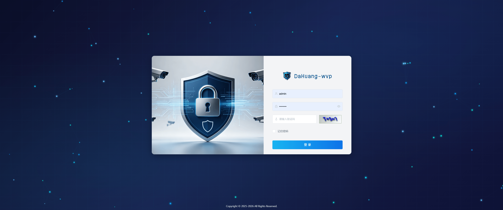</td>
        <td>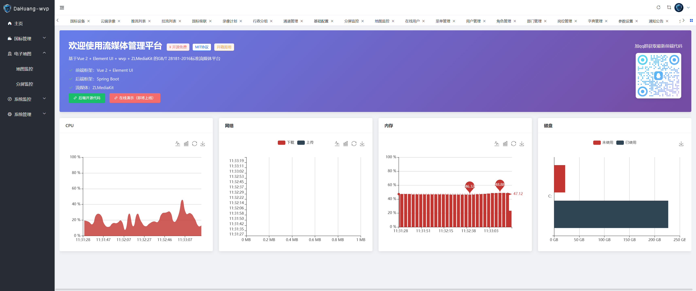</td>
    </tr>
    <tr>
        <td>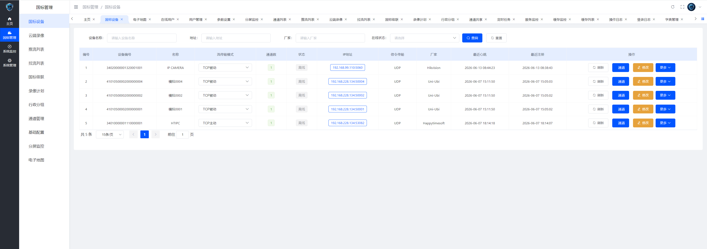</td>
        <td>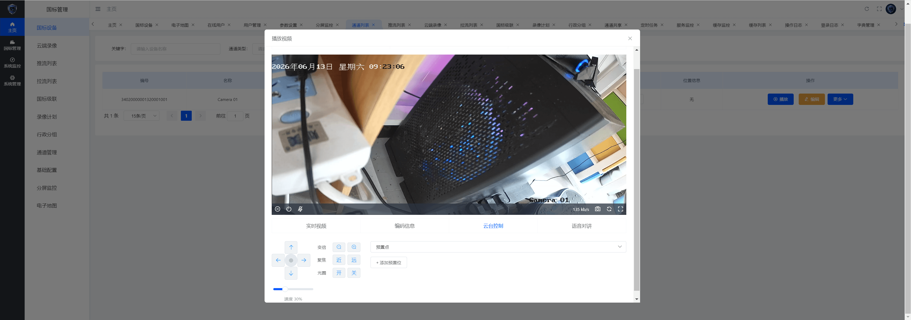</td>
    </tr>
    <tr>
        <td>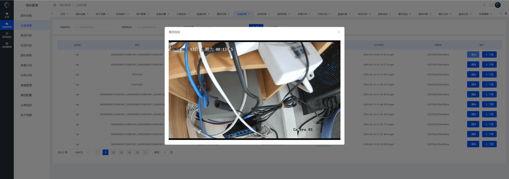</td>
        <td>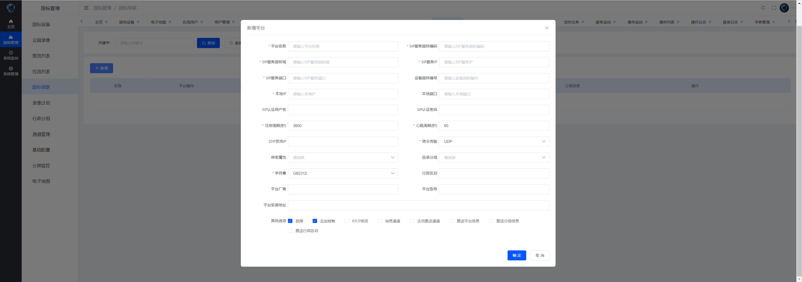</td>
    </tr>
    <tr>
        <td>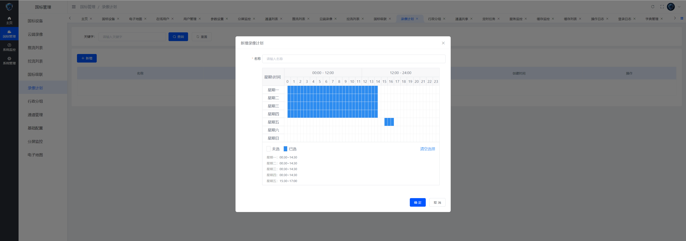</td>
        <td>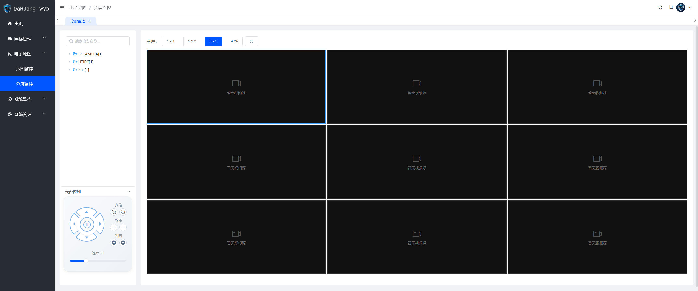</td>
    </tr>
    <tr>
        <td>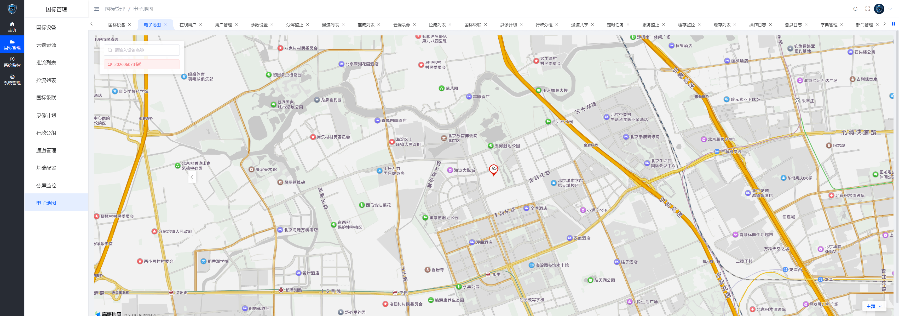</td>
        <td>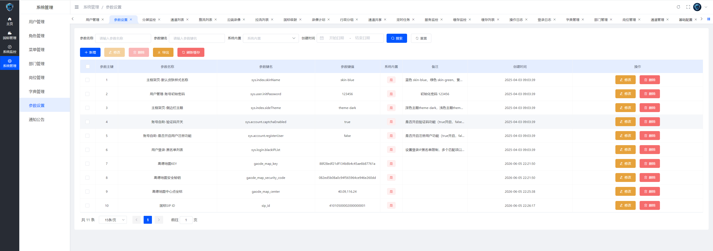</td>
    </tr>
    <tr>
        <td colspan="2" align="center">Pro版功能</td>        
    </tr>
    <tr>
        <td>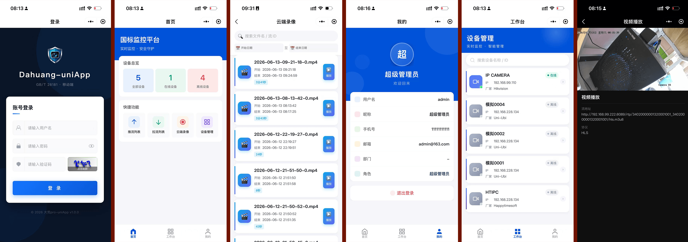</td>
        <td>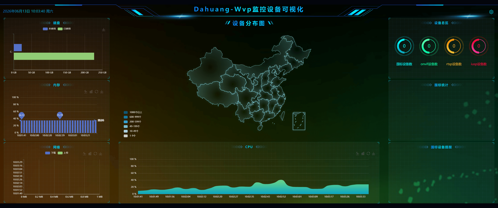</td>
    </tr>
    <tr>
        <td>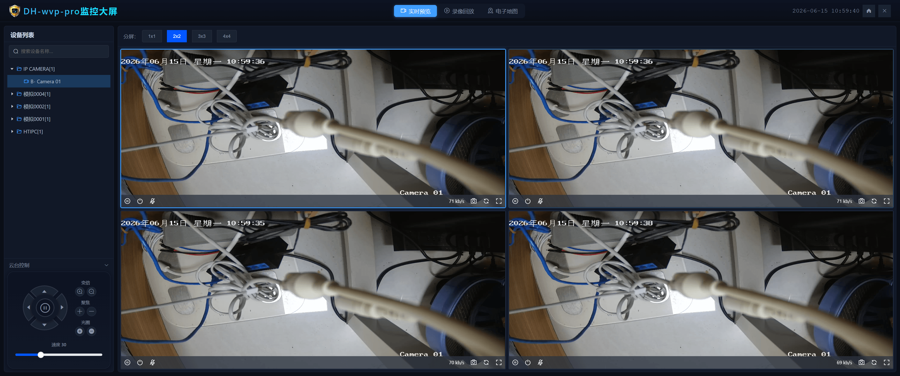</td>
        <td>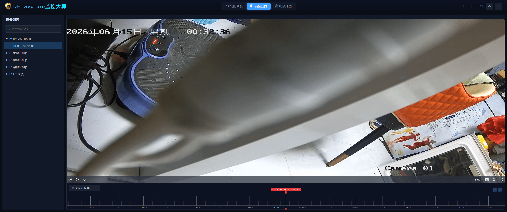</td>
    </tr>
    <tr>
        <td>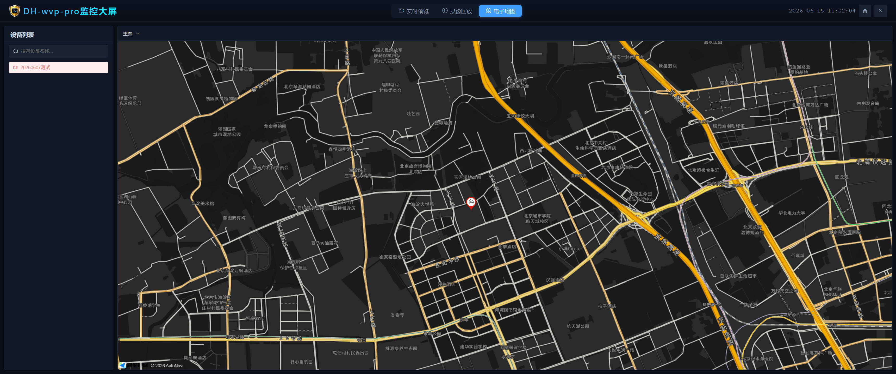</td>        
    </tr>
</table>

## 前端源码

加qq群获取最新前端vue代码

 

## 功能特性
* 集成web界面
* 兼容性良好
* 跨平台服务，一次编译多端部署， 可以同时用于x86和arm架构
* 接入设备
* 视频预览
* 支持主码流子码流切换
* 无限制接入路数，能接入多少设备只取决于你的服务器性能
* 云台控制，控制设备转向，拉近，拉远
* 预置位查询，使用与设置
* 查询NVR/IPC上的录像与播放，支持指定时间播放与下载
* 无人观看自动断流，节省流量
* 视频设备信息同步
* 离在线监控
* 支持直接输出RTSP、RTMP、HTTP-FLV、Websocket-FLV、HLS多种协议流地址
* 支持通过一个流地址直接观看摄像头，无需登录以及调用任何接口
* 支持UDP和TCP两种国标信令传输模式
* 支持UDP和TCP两种国标流传输模式
* 支持检索,通道筛选
* 支持通道子目录查询
* 支持过滤音频，防止杂音影响观看
* 支持国标网络校时
* 支持播放H264和H265
* 报警信息处理，支持向前端推送报警信息
* 语音对讲
* 支持业务分组和行政区划树自定义展示以及级联推送
* 支持订阅与通知方法
* 移动位置订阅
* 移动位置通知处理
* 报警事件订阅
* 报警事件通知处理
* 设备目录订阅
* 设备目录通知处理
* 移动位置查询和显示
* 支持手动添加设备和给设备设置单独的密码
* 支持平台对接接入
* 支持国标级联
* 国标通道向上级联
* WEB添加上级平台
* 注册
* 心跳保活
* 通道选择
* 支持通道编号自定义, 支持每个平台使用不同的通道编号
* 通道推送
* 点播
* 云台控制
* 平台状态查询
* 平台信息查询
* 平台远程启动
* 每个级联平台可自定义的虚拟目录
* 目录订阅与通知
* 录像查看与播放
* 支持电子地图。等WVP相关功能

## 授权协议

-本项目自有代码使用宽松的MIT协议，在保留版权信息的情况下可以自由应用于各自商用、非商业的项目。 但是本项目也零碎的使用了一些其他的开源代码，在商用的情况下请自行替代或剔除； 由于使用本项目而产生的商业纠纷或侵权行为一概与本项目及开发者无关，请自行承担法律风险。 在使用本项目代码时，也应该在授权协议中同时表明本项目依赖的第三方库的协议。

## 特别致谢

- 感谢作者[夏楚](https://github.com/xia-chu) 开源了这么棒流媒体服务框架。
- 感谢作者[wvp](https://github.com/648540858/wvp-GB28181-pro) 开源了这么棒国标服务器框架。
- 感谢作者[若依](https://ruoyi.vip/) 开源了这么棒快速开发框架。
- 感谢作者[公安县泉姒禾网络科技工作室](https://gitee.com/xiaochemgzi/RuoYi-Wvp.git) 开源wvp做了集成。

## 赞赏方式
* 如果你感觉项目对你有帮助,请我们喝杯咖啡吧！
<table>
    <tr>
        <td></td>
        <td></td>
    </tr>
</table>
